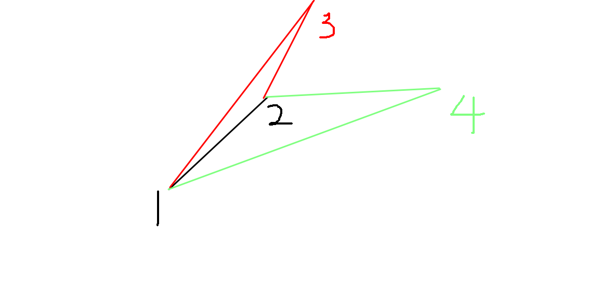

 ## A. Subsequence

枚举答案区间的右端点 R.

虽然有极差有上下限制. 但是只用找到最小的 L 满足区间的极差小于上限, 检验是否满足下限. 

并且我们可以发现 L 是随着 R 增加而增加的. 所以我们可以用双指针和滑动区间的方法.

## B. Alice's mooncake shop

首先把绝对的时间以小时为单位化为相对的时间. 

发现如果要在某个点做的话, 就是贪心从保质期内的时间选择一个价格最低的点.

虽然价格会动态变化, 但是队列里的相对关系不会变.

在新的点入队的时候, 算出实际的价格比较就行了.

## C. Trade

设 $dp[i][j]$ 表示第 i 天结束时有 j 份股票时的最大收益. 

1. 卖股票的情况  

   $dp[i][j]=\max\{dp[p][j']+(j'-j)\times b[i]\}$

   $dp[i][j]+j\times b[i]=max\{dp[p][j']+j'\times b[i]\}$

   因为 j' 大于 j, 所以我们可以在用一个滑动窗口的方法维护其最大值. 在枚举 j 的时候顺便将 j' 加入单调队列. 

2.  买股票的情况类似. 

注意初始情况的处理, 前 w + 1 天不能买股票. 

## D. Fxx and game

$dp[i]$ 表示变成 i 的最小步数.

## E. Picnic Cows

同一组的数一定是排序的序列连续的一段.

考虑前 i 个数的时候. 设 $dp[i]$ 表示最小的花费.

可以写出转移方程 $dp[i] = \min\{dp[j]+(s[i]-s[j])-a[j + 1] * (i-j)\}$

考虑斜率优化: $y = kx + b$: 

1. $b = dp[i] - s[i]$
2. $k=i$
3. $x=a[j+1]$
4. $y=dp[j]-s[j]+a[j+1]*j$

那么相当于有一些点 $(x, y)$ , 求一个点使得一条斜率为 $k$ 的斜率过该点时截距最小. 

我们假设 $slope(i)$ 表示 $(x_i, y_i)$ 和 $(x_{i+ 1}, y_{i+1})$ 连线的斜率.

1. 如果只有一个点, 那么该点则为决策点. 
2. 如果  $slope(i)\le k$ 则该点没有下一个点优.
3. 如果  $slope(i)> k$ 则该点比下一个点优.

所以需要维护一个下凸壳, 即 $slope(i)$ 单增的点集.

**比较斜率的时候要注意符号. **

## F. Division

设 $dp[r][i]$ 表示考虑了前 i 个数, 最后一段是第 r 段的情况. 

$dp[r][i]=min\{dp[r-1][j]+(a[j+1]-a[i])^2 \}$

那么做法和上一题基本是一致的.

## G. MAX Average Problem

用 $s[i]$ 表示前缀和, 即求 $max\{\frac{s[i]-s[j]}{i-j} \}$

这题看起来是裸的求斜率, 但是我感觉比前几题复杂. 

维护下凸壳.

因为并没有固定的斜率, 而是某两点连线的斜率. 

而这个斜率并没有单调性, 所以不能弹出队首的点. 

如图, 原来有 1, 2 两个点,  如果新的点是 3, 4, 那么最优的决策点分别是 2, 1. 

因为下凸壳上的连线斜率单调增. 可以二分求决策点. 

## H. Print Article

和奶牛那个题类似的做法. 

## I. The Elder

如果是一条链, 那么这道题和 H 是一样的. 

唯一不同的是要置 $dp[1]=-p$ 因为到首都不需要检查. 

而是树的时候, 考虑每个节点出发到根节点的最短时间.

其实也是处理链的问题. 

考虑怎么动态维护存有下凸壳点的队列, 在每个点上时都能得到对应的队列. 

我们的操作有弹出一些点和加入自己到队末. 

可以用两个栈存一下队首和队尾被弹出的点. $DFS$ 该点和子树后, 退栈时恢复原来的队列. 

> 下面两题都是决策单调性, 代码很好懂, 但是我不会证明. 所以先不写了

## J.  Tree Construction	

## K. Monkey Party	

## L. Lawrence	

题目中的价值的两倍就等于区间的和平方减去平方的和. 

斜率优化求最小化问题.
