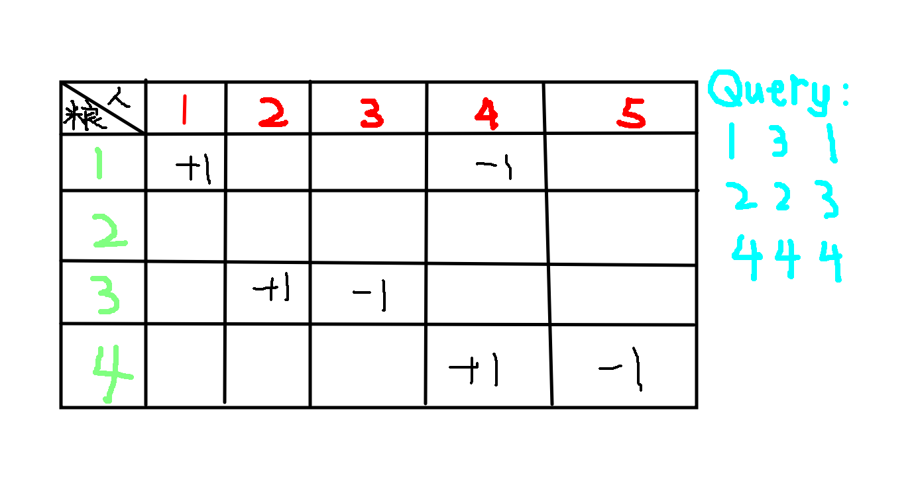

### A. CD操作

树上距离：$dis(a,b)=dep(a)+dep(b)-dep(lca)\times 2$

### B. How far away ？

类似上一题。

### C. Connections between cities

类似上一题。

### D. Gold Mine

不知道为什么把这道题放在这个专题。
这是我第一次接触到这个算法[最大权闭合图](https://www.cnblogs.com/wuyiqi/archive/2012/03/12/2391960.html)
对这道题的建图就是把价值连源点，花费连汇点，再把依赖关系连容量正无穷的边。

### E. Tree

区间修改，单点查询。

那么可以用差分的方式处理树链加减。  

### F. Dylans loves tree
因为 For each ② question,it guarantees that there is at most one value that appears odd times on the path.

那么路径上所有点异或和就是所求。

### G. The LCIS on the Tree
我的第一想法就是 dp 处理每条链的信息，但是合并时候太过繁琐，因为合并 LCA 所在的链需要调转方向，而且维护不完整的链也很乏力。  
但是我们可以用线段树来维护链的信息，每个节点记录含左右端点的和可以不含的最长上升连续序列，和下降序列的长度，并且记录左右端点的值。只需要重载 + 号，考虑怎么合并就行了。  
线段树的合并是显然的，合并路径上的链要复杂一些。我们发现其实和线段树的节点合并本质上是一样的。只是在合并 LCA ~ u 和 LCA ~ v 时候，我们发现需要把其中一条链翻转然后合并信息。也就是交换左右方向的值，把上升连续序列和下降连续序列的信息交换。

```cpp
struct node {
    int len, lc, fc, rc, LC, FC, RC, lv, rv;
    void init(int x = 0) {
        lc = fc = rc = LC = RC = FC = len = 1;
        lv = rv = x;
    }
    void reverse() {
        swap(rc, LC);
        swap(lc, RC);
        swap(FC, fc);
        swap(lv, rv);
    }
    node operator + (const node &x) const {
        if (x.lc == 0) return *this;
        if (lc == 0) return x;
        node b;
        b.len = len + x.len;
        b.lv = lv;
        b.rv = x.rv;
        b.lc = (lc == len) && (x.lv > rv) ? lc + x.lc : lc;
        b.rc = (x.rc == x.len) && (x.lv > rv) ? rc + x.rc : x.rc;
        b.fc = max({fc, x.fc, (x.lv > rv ? x.lc + rc : 0)});
        b.LC = (LC == len) && (x.lv < rv) ? LC + x.LC : LC;
        b.RC = (x.RC == x.len) && (x.lv < rv) ? RC + x.RC : x.RC;
        b.FC = max({FC, x.FC, (x.lv < rv ? x.LC + RC : 0)});
        return b;
    }
};
```
### H. Query on a tree 
我们只用离线询问，按 x 递减的顺序处理就行。  

### I. Relief grain
很有意思的一道题。  
我们单独考虑，如果只是一条链（也就是一个序列），我们怎么做。  
如果把所有操作汇成一张表格：

维护一个线段树，保存每种粮食的数量。逐列处理信息，那么到每个人时，线段树维护的就是他的粮食情况。线段树查询时在最大值的前提下尽量走左子树就可以保证编号最小。

### J. Occupation 
简单模拟。

### K. Tree chain problem 
考虑树上 dp。dp[v] 表示 v 为根节点的子树选择包含的链的最大价值。合并时，考虑加入 u 节点后新增的链，也就是以 u 为 LCA 的链。


### L. Little Devil I 
>There is an old country and the king fell in love with a devil. The devil always asks the king to do some crazy things. Although the king used to be wise and beloved by his people. Now he is just like a boy in love and can’t refuse any request from the devil. Also, this devil is looking like a very cute Loli.

感觉题目描述很刑。  
以前看到这种题肯定无从下手，但这次我很快就有思路了，是不是有进步了呢？

用每个节点 u 代表 $fa_u$ 到 $u$ 这条边。
操作 1 很显然，维护一颗支持异或操作的线段树。  
对于操作 2，单独开一颗线段树，支持的操作和 1 相同。节点的值改变代表它所在的子树颜色改变(不包含它自己)。所以操作 2 也可以简单维护。  
最后我们发现，每个点的状态其实只受自己和父亲节点影响。
合并的时候套路和“The LCIS on the Tree”是一致的。

### M. The Water Problem 
很符合名字。

### N. Interviewe
这题有点问题，我也不会做。
参考: [https://vjudge.net/problem/HDU-3486](https://vjudge.net/problem/HDU-3486)

### O. GCD
1. 求区间 GCD 值，用线段树或者 st 表都可以维护。
2. 求 GCD 等于某个值的区间数量

问题 2 是一个经典问题。
搬一下我以前写的题解。

题目： [UVa1642](https://www.luogu.com.cn/problem/UVA1642)

因为要求一个最优的子序列，可以想到枚举这个子序列的右端点$j$。  那么怎么快速算出左端点$i$的答案呢？  
枚举每一个左端点，如果能知道这个子序列所有元素的$gcd$值就好了。  
先考虑这样一个序列$5,8,8,6,2$，假设现在$j=4$,可以算出所有子序列对应的$gcd$。
1. $i=1$, $gcd(a_1,a_2,a_3,a_4)=1$
2. $i=2$, $gcd(a_2,a_3,a_4)=2$
3. $i=3$, $gcd(a_3,a_4)=2$
4. $i=4$, $gcd(a_4)=6$

注意到不同子序列的$gcd$值有可能是相等的，事实上$gcd$值的种类最多不会超过$\log_2 a_j$个，因为$a_j$的约数个数一定不多于$\log_2 a_j$。  
上表从下向上看，每次增加一个元素的时候，$gcd$值是不变或者减小的，而且变小时一定会变成$a_j$的一个约数。所以就维护每个左端点对应的区间$gcd$值(即$gcd(a[i],a[i+1],...,a[j])$)，增加一个元素(即$j$ -> $j+1$)时，更新加上该元素后的区间$gcd$值就可以。  
知道了当前每个左端点对应的$gcd$，区间长度也是已知的，就可以计算答案了，对于每个区间的结果取一个最大值。  
但是直接这样做复杂度是不对的，$O(n^2log n)$显然过不了。那怎么办呢。
我们可以发现，如果两个左端点的$gcd$相等，那么$i$更小的一定会更优，所以直接把劣的删除，对后面不造成影响。这样一来每次要枚举的$i$就和$gcd$的个数有关，复杂度是$O(nlog^2 n)$，可以通过本题。


```cpp
#include<bits/stdc++.h>
using namespace std;

typedef long long ll;
const int N = 1e5 + 5;
ll n, a[N];
vector<pair<int, ll> > v;

ll read() {
	ll w = 0; char ch = getchar();
	while(ch > '9' || ch < '0') ch = getchar();
	while(ch >= '0' && ch <= '9') {
		w = w * 10 + ch - 48;
		ch = getchar();
	}
	return w;
}
ll gcd(ll a, ll b) {
	return b == 0 ? a : gcd(b, a % b);
}

int main() {
    ll T = read();
    while(T--) {
    	ll ans = 0; v.clear();
    	n = read();
    	for(int i = 1; i <= n; i++) a[i] = read();
        for(int j = 1; j <= n; j++) {
            v.push_back({j, a[j]});
            for(int i = v.size() - 2; i >=0; i--) {
            	v[i].second = gcd(v[i].second, a[j]);
            	if(v[i].second == v[i + 1].second) v.erase(v.begin() + i + 1);
            }
            for(int i = 0; i < v.size(); i++) {
            	ans = max(ans, (j - v[i].first + 1) * (v[i].second));
            }
        }
        printf("%lld\n", ans);
    }
    return 0;
}
```

### P. Taotao Picks Apples
这是一道好题。  
用线段树维护区间最大值，按题目要求能选出的数个数, 记作 cnt。
怎么合并某两个区间？假设左边区间最大值是 X, 那么我们需要知道右区间只选大于 X 的数，能选出多少个（不要求第一个必须选）。
比如查询线段树上某个节点 x ： query(l, r, lim)
我们可以分类讨论: 

1. MAX[lson] <= lim, query(l, r, lim) = query(mid + 1, r, lim)
2. MAX[lson] > lim, query(l, r, lim) = cnt[x] - cnt[lson] + query(l, mid, lim)

### Q. Glad You Came 
吉老师线段树模板题。 

https://oi.wiki/ds/seg-beats/
